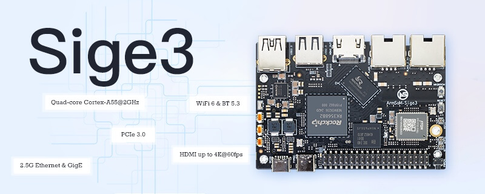
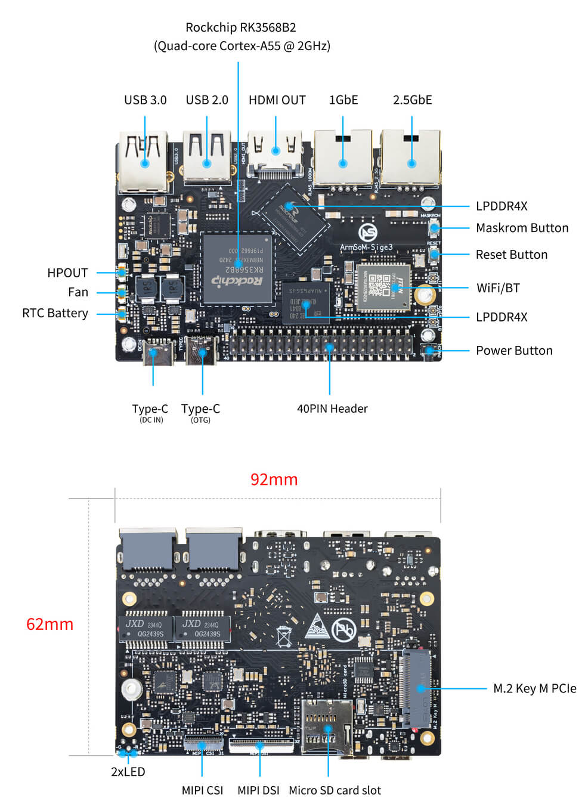
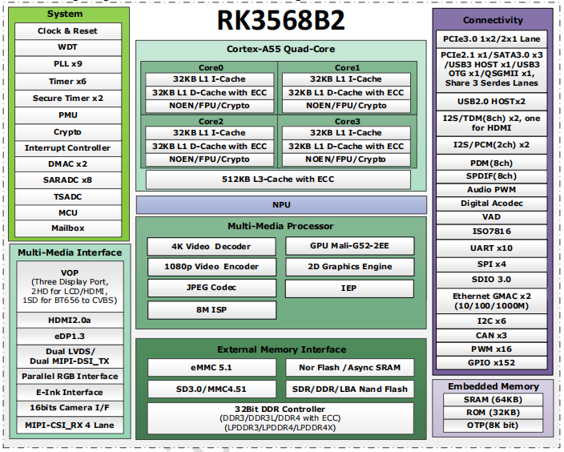
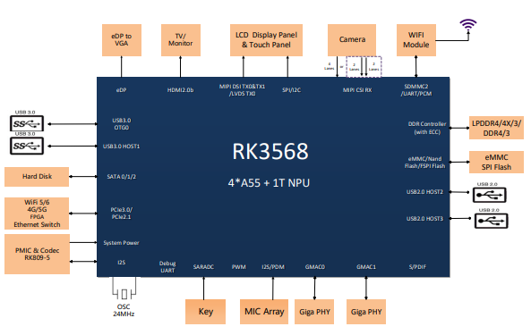

## RK3568b2 Development Board Introduction

### ArmSoM-Sige3 RK3568b2 Development Board

The ArmSoM-Sige3 features the Rockchip RK3568B2, a high-performance and low-power quad-core application processor designed for personal mobile internet devices and AloT devices. The Sige3 supports up to 4K@60 HDMI, MIPI DSI, MIPI CSI, USB ports, Gigabit Ethernet, 2.5G network port, PCIe 3.0, 40-PIN GPIO expansion header, and RTC.

More details：https://docs.armsom.org/armsom-sige3 

## RK3568 Brief datasheet

A high performanceand low power quad core application processor
<table>
    <thead>
        <tr>
            <th>Features</th>
            <th>Chip Specifications</th>
        </tr>
    </thead>
    <tbody align="left">
        <tr>
            <th>CPU</th>
            <th>Quad-core ARM Cortex - A55 processor</th>
        </tr>
        <tr>
            <th>GPU</th>
            <th>
                <li>ARM G52 - 2EE</li>
                <li>OpenGL ES1.1/2.0/3.0/3.1/3.2, Vulkan 1.1, OpenCL 2.1</li>
            </th>
        </tr>
        <tr>
            <th>NPU</th>
            <th>
                <li>1TOPS@INT8</li>
                <li>Support INT8/INT16/FP16/BFP16</li>
                <li>Support deep learning frameworks like TensorFlow, Caffe, Tflite, Pytorch, Onnx, Android NN, etc</li>
            </th>
        </tr>
        <tr>
            <th>Memory</th>
            <th>
                <li>32bit DDR4/3/3L/LPDDR4/4X/3</li>
                <li>DRR4 and DDR3 support ECC</li>
                <li>Support eMMC5.1, SFC</li>
            </th>
        </tr>
        <tr>
            <th>Display</th>
            <th>
                <li>Multiple display engine, max 3 screen support</li>
                <li>HDMI2.0</li>
                <li>eDP 1.3</li>
                <li>Dual MIP - DSI, combowith single LVDS</li>
                <li>24bit RGB/BT1120</li>
                <li>EBC interface</li>
            </th>
        </tr>
        <tr>
            <th>Multimedia</th>
            <th>
                <li>4K H.265/H.264 VP9 video decoder</li>
                <li>1080p@60fps H.264/H.265 video encoder</li>
            </th>
        </tr>
        <tr>
            <th>Video Input</th>
            <th>
                <li>8M PixelISP with HDR&3DNR</li>
                <li>1×4lanes or 2×2lanes MIPI CS - 2 and DVP interface</li>
            </th>
        </tr>
        <tr>
            <th>Audio Interface</th>
            <th>
                <li>12S0/2S1 with 8 channels</li>
                <li>12S2/12S3 with 2 channels</li>
                <li>SPDIFO</li>
                <li>PDMO with 8 channels</li>
                <li>TDMO with 8 channels</li>
                <li>VAD (Voice Activity Detection)</li>
            </th>
        </tr>
        <tr>
            <th>High Speed Interface</th>
            <th>
                <li>One USB 3.0 host, three SATA3.0,</li>
                <li>one USB 3.0 OTG, one PCle 2.1, one QSGMII</li>
                <li>Share three serdes lanes</li>
                <li>Dual USB 2.0 host</li>
                <li>PCle 3.0,1×2 lanes or 2×1 lane</li>
                <li>Dual RGMII interface</li>
            </th>
        </tr>
        <tr>
            <th>Security</th>
            <th>
                <li>ARM Trustzone security extension</li>
                <li>Secure Video Path</li>
                <li>Secure JTAG to debug</li>
                <li>Secure boot</li>
                <li>OTP</li>
                <li>Crypto (AES/TDES/SM4/SM3/SHA256/SHA512/RSA)</li>
            </th>
        </tr>
        <tr>
            <th>SDK</th>
            <th>
                <li>Linux4.19&5.10</li>
                <li>Android11&12</li>
            </th>
        </tr>
        <tr>
            <th>Others</th>
            <th>
                <li>Package: FCBGA636L&FCCSP636L</li>
                <li>Body: 19mm×19mm</li>
                <li>Ball pitch: 0.65mm</li>
            </th>
        </tr>
    </tbody>
</table>

### RK3568b2 Block Diagram

### RK3568 Typical Application Diagram-AloT

